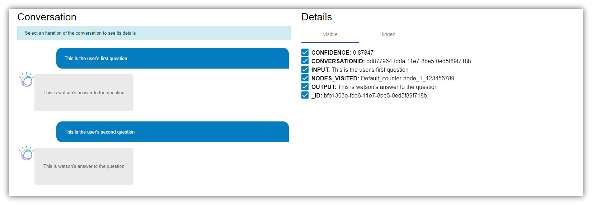

# WatsonConversationUI

This project provides an angular component to visualize conversations generated with Watson Conversation and the details of each element of the conversation.



## Installation

```
npm install watson-conversation-ui --save
```

### Dependencies

- [Bootstrap 4](https://getbootstrap.com/docs/4.0/getting-started/download/)
```
npm install bootstrap
```

- [Angular Material](https://material.angular.io/guide/getting-started)
```
npm install --save @angular/material @angular/cdk @angular/animations
```

- And don't forget to include into your styles.css the Angular Material Theme:
```scss
// styles.css
@import '~@angular/material/prebuilt-themes/indigo-pink.css';
```

- Alternatively, if you are not using Angular CLI, you can add it directly to your index.html
```html
<link href="node_modules/@angular/material/prebuilt-themes/indigo-pink.css" rel="stylesheet">
```

## Usage

In a typical Watson Conversation architecture, we have a database that stores all the conversations that Watson has received.

This component allows you to visualize conversations stored in the database in a dialog style.

To do this, we build a JavaScript array with the records of the conversation and we provide it to the component. We also provide a configuration variable to indicate which are the fields corresponding to the user input and the watson output.

### Example: 

1. We have all the conversations records in a DB2 database and the conversations are identified by the field "conversationid".
2. We include WatsonConversationUi in our module.ts.
```typescript
// app.module.ts
import { WatsonConversationUiModule } from 'watson-conversation-ui';
```
3. We construct an array with all records with the same "conversationid".

```typescript
// app.component.ts
const myConversation = [
    {
        _ID: 'bfe1303e-fdd6-11e7-8be5-0ed5f89f718b',
        INPUT: 'This is the user\'s first question',
        OUTPUT: 'This is watson\'s answer to the question',
        CONFIDENCE: 0.87847,
        NODES_VISITED: 'Default_counter-node_1_123456789',
        CONVERSATIONID: 'dd877964-fdda-11e7-8be5-0ed5f89f718b'
    },
    {
        _ID: 'a51bbd6a-fdda-11e7-8be5-0ed5f89f718b',
        INPUT: 'This is the user\'s second question',
        OUTPUT: 'This is watson\'s answer to the question',
        CONFIDENCE: 0.97483,
        NODES_VISITED: 'node_2_2134544',
        CONVERSATIONID: 'dd877964-fdda-11e7-8be5-0ed5f89f718b'
    }
]
```

4. Then we pass the array to our component using "conversation" attribute.

```html
<!-- app.component.html -->
<watson-conversation-ui [conversation]="myConversation"></watson-conversation-ui>
```

This would show the following dialog:


If your conversation shows backwards you cann use a component attribute called "reverse" and set it to "true. **Example**:

```html
<watson-conversation-ui [conversation]="myConversation" [reverse]="true"></watson-conversation-ui>
```

### Conversation details

We use to store a lot of information about conversations but to visualize them only a few are relevant. So, this component allows you to hide some attributes of the conversation by unchecking them in the details list.

To show them again you only have to check them in the "hidden fields" tab.


### Configuration

By **default**, this component assumes the input field is called *"INPUT"*, the output field *"OUTPUT"* and the field that identifies each iteration of the conversation *"_ID"*.

```typescript
// Default configuration object
{
    iterationid: '_ID',
    input: 'INPUT',
    output: 'OUTPUT'
}
```

If we have different fields to identify these properties, we can use a configuration object and pass it to the component.

```typescript
// app.component.ts
const config: {
    iterationid?: string,
    input?: string,
    output?: string
  } = {
      iterationid: 'id',
      input: 'userinputfield',
      output: 'watsonoutputfield'
    }
```

### Map attributes

It may be that some of the attributes of the conversation need to be processed before displaying them. To do this, within the configuration object, we can add the property "map" which is an object that has, as keys, the names of the attributes to be mapped and, as values, the mapping functions.

```typescript
// app.component.ts
const config: {
    iterationid?: string,
    input?: string,
    output?: string,
    map?: any
  } = {
      iterationid: '_ID',
      input: 'INPUT',
      output: 'OUTPUT',
      map: {
          CONFIDENCE: (item) => {
              return item.toFixed(2);
          },
          INPUT: (item) => {
              return item.toUppercase();
          }
      }
    }
```